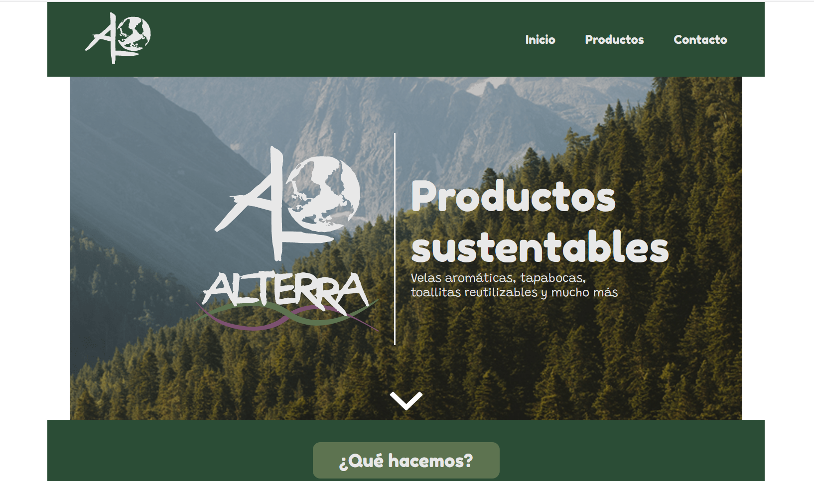
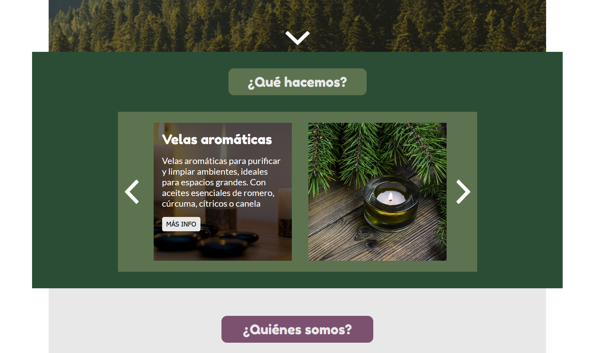

# Alterra

## This is the repo of the Alterra ecommerce site

Alterra is a company that makes sustantable products, like creams, candles and textiles.

To run the (mock) website you can just run 'npm run dev' in the command line, and go to http://localhost:3000 in your web browser.

### Screenshots:

## Este es el repositorio de la tienda virtual de Alterra

Alterra es una compania que se dedica a la venta de productos sustentables, como cremas, velas y textiles.

To run the (mock) website you can just run 'npm run dev' in the command line, and go to http://localhost:3000 in your web browser.
Para correr la web (versión mock) simplemente puede correr 'npm run dev' en la linea de comandos e ir a http://localhost:3000 su navegador web.

